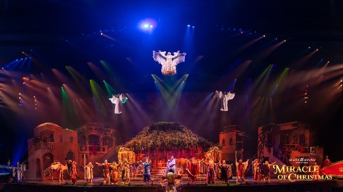

# IT Operations Leadership & Project Management | System Administration | Cloud Infrastructure & Automation

I didn’t take the traditional IT path—I built my career from the ground up, starting in high-pressure live production environments before expanding into IT operations, cloud infrastructure, and automation.

That hands-on experience shaped how I approach technology today. I specialize in bridging the gap between enterprise IT, AV systems, and modern cloud solutions—optimizing technology for large-scale organizations while leading teams, managing infrastructure, and driving automation.

Currently, as an IT Operations Supervisor, I oversee enterprise infrastructure, security, automation, and strategic technology planning. I thrive in environments where I can streamline systems, reduce downtime, and implement cloud-driven solutions that create real impact.

Key Strengths:

✔ IT & Cloud Infrastructure (Azure, AWS, Microsoft 365)

✔ Automation & System Optimization (Intune, Auto-Pilot, PowerShell, Python)

✔ Enterprise AV & Networked Media (Teams Rooms, AV-over-IP, Digital Signage)

✔ Leadership, Training & Project Management (Agile, Budgeting, Vendor Relations)

---

## Certifications

CompTIA A+ and Network+ Certified

Microsoft Azure (AZ-900) and 365 (MS-900) Certified

Google IT Support Professional Certified

## Manufacturer Training

USITT - Electrical Basics & Safety Training

Vectorworks - LDI Spotlight Training

Columbus McKinnon - Entertainment Technology Motor Mechanic Training

ETC - Eos Family Consoles Training

Allen & Heath - iLive Digital Audio Training

## Currently Learning

PMI - Project Management Professional Certification

AZ-104 - Microsoft Azure Administrator Certification

SAA-C03 - AWS Solutions Architect Associate Certification

LPI - Linux Essentials Certification

Google - IT Automation with Python Professional Certification

GitHub Foundations - Certification Program

DataCamp SQL Associate Certification

## Projects

### <a href=https://github.com/jonriggert/journey-to-the-clouds>Journey to the Clouds</a>

<figure>
  
  <figcaption>My GitHub repo where I document my learning journey toward AWS and Azure speciality roles - learning Infrastrucutre as Code and Automation. My code is stored here as I learn it, as well as notes and documentation - and my daily journal of what I've learned! </figcaption>
</figure>

## Experience

### Sight & Sound Ministries Inc. - Branson Missouri / Lancaster Pennsylvania 

Information Technology Operations Supervisor
(May 2023 - Present)
Led operations for a multi-campus 329,000 sq ft performing arts facility with a $500,000 annual IT budget and a 20-person hybrid team, reporting to a larger remote IT leadership structure.

Managed and completed major capital projects including:
- Multi-site IP security camera and access control system overhaul (200+ cameras, 2-year archival system).
- Onsite server and cloud infrastructure modernization.
- Deployment of a digital concession menu board & conference room AV. 
- Establishment of a fully staffed, on-site phone-based ticket contact center.
- Drove the adoption of Agile methodologies to improve help desk workflows, change management, and cross-team collaboration.
- Regularly conducted 1:1s and annual reviews, integrating SMART goals and KPIs to guide technician performance and seasonal staffing decisions.
- Created, revised, and enforced SOPs, SLAs, and escalation protocols to improve service reliability and professionalize team communication.
- Negotiated vendor contracts and procurement agreements for hardware, software, and managed services.

System Administrator
(June 2018 - May 2023)
- Administered Microsoft 365 & Azure services for a multi-campus organization with 1,000+ employees.
- Led deployment of a Microsoft Teams-based phone system, improving communication across multiple locations.
- Automated IT processes using Intune & Auto-Pilot, streamlining device provisioning and reducing setup time.
- Enhanced security posture by managing DNS, DHCP, VPN appliances, and Azure Active Directory policies.
- Contributed to an organization-wide shift to Agile workflows, optimizing service desk and project collaboration.
- Designed and implemented a multi-site IP security camera system with 100+ cameras and two years of archival storage.

### Paragon 360 - Springfield Missouri
Audio-Visual Installer
(2018)

<figure>
  
  <figcaption>While working with Paragon 360, I was able to assist the team in installing an all new AVL system in this new 2000 seat facility. This included a dual-projection unit and LED lighting. </figcaption>
</figure>

### Southwest Audio Visual - Springfield Missouri
Live Event Technician
(2018)

### Museum of the Bible - Washington D.C.
Audio Visual Engineer
(July 2017 - November 2017) 
As the AV and Lighting Engineer for a $1 billion museum startup located near the U.S. Capitol and Smithsonian Museums, I was responsible for the final-phase integration of advanced audiovisual, lighting, and digital interactive systems across 12 theatrical and exhibit venues. The museum aimed to be the most technologically advanced in the world, incorporating:

- A 100-foot LED ceiling screen, GPS-controlled docent tablets, dynamic lobby signage.
- Elevator AV systems, projection mapping in immersive environments.
- Layered lighting infrastructure: theatrical, architectural, exhibit-specific, and temporary.
- Led technical coordination across 7 independent AV contractors, ensuring all systems could be monitored and automated through a unified control interface.
- Balanced uniformity of system control with creative freedom, as each exhibit floor had unique architectural and functional needs.
- Designed infrastructure not just for current installations but for future-proofing temporary exhibits, including high-capacity networking, flexible power layouts, and scalable lighting/data solutions.
- Facilitated cross-discipline communication between exhibit designers, lighting designers, IT, and museum leadership to ensure AV/lighting aligned with both aesthetic and operational goals.
- Successfully opened the museum on schedule with fully integrated AV and lighting systems across all spaces.
- Helped establish the foundation for ongoing tech operations and infrastructure scaling for future exhibits.

<figure>
  
  <figcaption>Install of the largest indoor celing mounted LED screen for the main lobby of Museum of the Bible.</figcaption>
</figure>

<figure>
  
  <figcaption>Heat Mapping for Environmental Projection in main theatre at Museum of the Bible using VYV media server software.</figcaption>
</figure>

<figure>
  
  <figcaption>Acoustic Mapping for Meyer Constellation Audio in main theatre at Museum of the Bible.</figcaption>
</figure>

<figure>
  
  <figcaption>Final mockup of projection mapping project.</figcaption>
</figure>

<figure>
  
  <figcaption>Final Product Realized using 18 Projectors operating on VYV media server controlled via Medialon control software. I was also responsible for the lighting system integration in this space controlled via GrandMA2, ETC dimming infrastructure, and Vectorworks Spotlight.</figcaption>
</figure>

### Sight & Sound Theatres - Branson Missouri
Automation & Electronics Technician
(November 2015 - July 2017)
- Provided Audio-Visual support, operation, training and leadership (Sound, Lighting, Projection, Media Servers, and Special Effects) for a 2000+ seat theatre possessing the second largest stage in North America, reaching an audience size of 650,000 people annually. 
- Programmed, maintained, analyzed, and resolved troubleshooting requests through a ticketing system. (Atlassian Jira, Trello & JitBit)
- Designed and programmed user interfaces for automation systems and managed PC/Mac machine remotely throughout the facility. 
- Handled installation and upkeep of computer hardware, software, media servers and audio-visual equipment. 
- Edited Audio & Video for 3D Projection & LED Video Walls / Sign Boards.

<figure>
  
  <figcaption>Upgraded projection stack for main projection screen (before and after) - lamp based to laser based.</figcaption>
</figure>

<figure>
  
  <figcaption>Behind the scenes - Two stacks of laser projectors on each side. Utilizing multiple media servers this created the brightness and redundancy needed for future productions that would rely heavily on mapped projection on multi-dimentional surfaces.</figcaption>
</figure>

<figure>
  
  <figcaption>Finished project. Also responsible for programming media content using Coolux Media Servers.</figcaption>
</figure>

<figure>
  
  <figcaption>I also served as the Master Electrician for the Lighting Department - handing the networking and electrical for shows utilizing over 1200 lights (150 automated lights).</figcaption>
</figure>

<figure>
  
  <figcaption>In addition, I took on the responsiblity of programming and running our fully automated flight system for performers duing our seasonal Christmas Show.</figcaption>
</figure>

### Carnival UK (P&O Cruises & Cunard) - Southampton U.K.
Assistant Production Manager (Lighting)
(January 2014 - November 2015)

<figure>
  
  <figcaption>Cunard 175 Anniversary Light Show in New York and Southampton UK.</figcaption>
</figure>
<figure>
  
  <figcaption>Behind the Scenes of 175 Anniversary Light Show on mid-deck using Clay Paky Mythos lighting.</figcaption>
</figure>

<figure>
  
  <figcaption>Programming lights for music show on Carnival Cruise Ship.</figcaption>
</figure>

<figure>
  
  <figcaption>Running lights for music show on Carnival Cruise Ship.</figcaption>
</figure>

### Royal Caribbean Group (Celebrity Cruises) - Miami Florida
Apprentice Audio-Visual Technician
(December 2012 - December 2013)

<figure>
  
  <figcaption>Lighting Programming, Maintenance, and Operation for full broadway production shows and rotating musical guests.</figcaption>
</figure>

<figure>
  
  <figcaption>Picture of maintaining the Robe LED lighting rig.</figcaption>
</figure>

### North Point Church - Springfield Missouri / Nixa Missouri / Republic Missouri
Intern Media Director
(May 2009 - December 2012)
At North Point Church, I led the audiovisual planning and execution for the expansion of two satellite campuses, while also standardizing and supporting AV operations across a three-campus system. This project included full system design, programming, installation, and volunteer coordination to ensure technical consistency and operational reliability across all 3 locations - with 12 services total each weekend. Oversaw end-to-end design and installation of AVL systems for new campuses, including:

- Yamaha digital audio consoles, HOG lighting control systems, Panasonic IMAG camera and switching systems.
- Coordinated installation timelines, contractor oversight, and infrastructure planning to ensure AV systems were aligned with buildout phases.
- Implemented a scheduling system and training pipeline for a team of 60+ volunteers supporting 12 weekly services/events across three campuses.
- Developed system documentation, live production workflows, and volunteer support protocols to maintain consistent production standards church-wide.
- Provided live service support and technical troubleshooting during launch and post-deployment phases.

<figure>
  
  <figcaption>North Point Church - full install and programming of AVL systems including Yamaha Audio Console, HOG Lighting Console, and Panasonic IMAG hardware.</figcaption>
</figure>

<figure>
  
  <figcaption>Serving as video director for 5 weekly services.</figcaption>
</figure>

<figure>
  
  <figcaption>Programming and running lighting system for over 10 Easter services across 3 locations and streamed online.</figcaption>
</figure>

<figure>
  
  <figcaption>Lighting Design - 10,000+ attendance for Easter services.</figcaption>
</figure>

<figure>
  
  <figcaption>Lighting Install and Design.</figcaption>
</figure>

### Southwest Baptist University - Bolivar Missouri
Assistant Technical Director
(September 2008 - December 2012)
- Received professional training directly from lighting (ETC EOS Family) and audio (Allen & Health / Community) systems for 1,300 seat campus auditorium. 
- Assisted with $1.5 million renovation (new seating, new projection / LED screen system, media system, audio, lighting, networking). 
- Provided frequent training and documentation to staff of work-study students on annual basis. 
- Led team meetings and oversaw calendar for event scheduling / determining if additional labor should be brought in for larger special events. 
- Served as main technical liaison for live event producers, reviewing performance riders and organizing requirements. 
- Provided assistance in installing and operating Audio-Visual equipment campus wide (Library, Other Performance Venues, Student Union, Basketball & Football Arena). 
- This was in conjunction with my technical studies in the Theatre department.

<figure>
  
  <figcaption>Lighting & Set Layout for CentriKid Camps - Pike Auditorium at Southwest Baptist University.</figcaption>
</figure>

---

## Education

- Southwest Baptist University B.A. · Communications (with focus on Speech, Education, and Technology) · December 2012

(Course of Study Included CIS-1103 Foundations of Computer Science, EDU-2823 Technology for Educators, THR-3011 Theatre Production, COM-3342 Media Production)

- Richmond R-XVI High-School · May 2008

## Volunteering

### The Table Church - Washington D.C.
Audio Volunteer for Worship Team

<figure>
  
  <figcaption>Running Audio for Multi-Site Church using QSYS and x32 Audio Consoles.</figcaption>
</figure>

### Relevant Life Church - Grew to become Life.Church Campus - Springfield Missouri
Lighting Volunteer / Consultant for Worship Team

<figure>
  
  <figcaption>Programming Lighting Using ChamSYS System & Portable Rig.</figcaption>
</figure>

<figure>
  
  <figcaption>Setup in school gym weekly - Assisting & training technicians in being able to do this autonomously.</figcaption>
</figure>

<figure>
  
  <figcaption>Lighting for worship service.</figcaption>
</figure>

<figure>
  
  <figcaption>The success of this project led to church growth which ultimately turned into a full Life.Church campus coming to Springfield. A lighting designer I trained from Relevant Life Church was able to land the weekly programming job at this campus and we collaborated weekly using Avolights console!</figcaption>
</figure>

### Pregnancy Life Line - Branson West Missouri
Advisory Board Member - AVIT Consultant

### Ozark Mountain Legacy
Web / Media / Streaming / Live Event Consultant

## Personality

### Myers Briggs
INTJ - The Architect

### DiSC
Type C - Conscientious and Even-Tempered

### Strengths Finder
1. Connectedness
2. Discipline
3. Consistency
4. Harmony
5. Intellection

#### Thank you for visiting my profile! I enjoyed learning how to create this website using vsCode, Git, and GitHub pages. 
